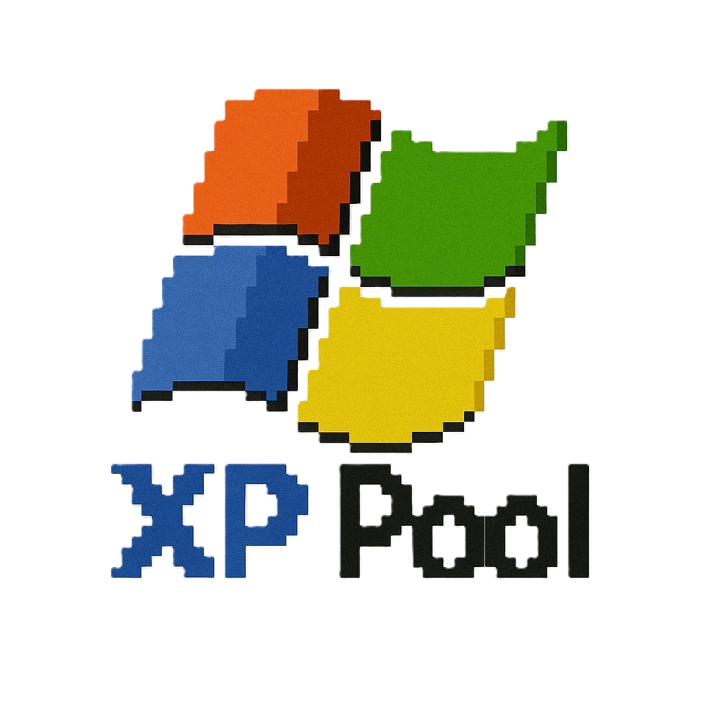

[](https://xppool.in)

A modern, XP-style web interface for **ckpool**, powering the live mining pool at [Xppool.in](https://xppool.in).  
This project provides a clean dashboard to monitor miners, connections, rewards, and wallets.

---

## ✨ Features
- 📊 Real-time hashrate charts
- 👥 Connected miners view
- 💰 Wallet & rewards page
- 🖼️ XP-style themed UI
- 🔍 Search & explorer functionality
- ⚡ Lightweight Python backend (Flask)

---

## 🌐 Live Demo
👉 Visit: [https://xppool.in](https://xppool.in)

### Preview


---

## 🚀 Installation

Clone the repository:

```bash
git clone https://github.com/Soumya001/web-ui-clean.git
cd web-ui-clean
